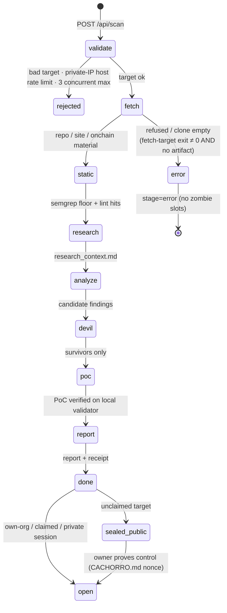
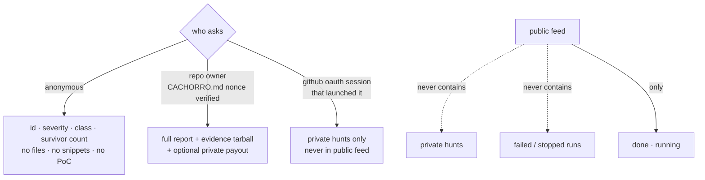

# ARCHITECTURE — how the pack is wired

> One page, three diagrams. `cachorro.jazzautomations.com.br` is a Next.js 15 app;
> hunts run as detached systemd units on the hunt box; the AI stage runs inside a
> mount+uid sandbox; reports are sealed until repo ownership is proven on-chain.

## 1 · System map

```mermaid
flowchart LR
    subgraph edge["edge"]
        U[user / judge] --> V[vercel proxy<br/>cachorro.jazzautomations.com.br<br/>WAF challenge]
        V -->|rewrite| F[tailscale funnel<br/>jazz-oracle.taild017e2.ts.net]
    end

    subgraph web["web · next.js :8790"]
        F --> API[/api/scan · /api/scan/:id<br/>/api/claim/repo · /api/billing<br/>/api/auth/github · /badge/:id/]
        API -->|publicScanView| SEAL{sealed?}
        SEAL -->|unclaimed: metadata only| U
        SEAL -->|owner-proven / private session| FULL[full report + evidence]
    end

    subgraph box["hunt box"]
        API -->|systemd-run transient unit| RJ[run-job-devin.sh]
        RJ --> FT[fetch-target.sh<br/>clone · program dump · site recon<br/>SSRF: DNS resolve → refuse private IP]
        FT --> SS[static-scan.sh<br/>grep/cargo-audit — no target build]
        SS --> DEVIN

        subgraph sbx["AI stage sandbox · untrusted hunts"]
            DEVIN[devin -p /cachorro-sol<br/>uid nobody · mount-ns<br/>/root + /etc/systemd/system bind-hidden<br/>env -i · cwd = work bind]
            DEVIN --> P[RESEARCH→ANALYZE→DEVIL→POC→REPORT<br/>jset + emit-event per step]
        end
        P --> RUN[(cachorro-out/runs/&lt;id&gt;<br/>status.json · events.jsonl<br/>report · findings · pocs)]
    end

    subgraph chain["on-chain"]
        RUN --> AT[attest: sha256 report||commit||journal_head]
        AT -.->|devnet memo<br/>cachorro:v1:&lt;digest&gt;| SOL[(solana)]
        CLAIM[/api/claim/repo<br/>CACHORRO.md nonce] -->|verified → once only| CLOAK[cloak shield→withdraw<br/>private payout rail]
        CLOAK -.-> SOL
    end
```

## 2 · Hunt lifecycle



## 3 · The seal (the product's point)



## 4 · Sandbox boundary (untrusted AI stage)

Anonymous targets are attacker-controlled content — a hostile `README.md` is a
prompt-injection weapon. The AI stage therefore runs at minimum privilege:

| layer | mechanism | effect |
|---|---|---|
| uid | `setpriv --reuid 65534` (nobody) | no sudo, no root-owned writes, no `CAP_SYS_ADMIN` |
| mounts | `unshare -m` + bind | `/root` and `/etc/systemd/system` hidden behind empty binds; repo bind-mounted rw |
| env | `env -i` | no inherited secrets/tokens (devin config copied into sandbox home) |
| fs scope | `chmod a+rwX` on run dir only | can write its own artifacts, nothing else |
| net | shared (model API needs it) | residual: can reach out; carries no secrets to exfil |

Attack surface left inside: prompt injection can make the agent write/delete
**within its own run dir** — self-harm only. Escape-verified: `ls /root` → empty,
`umount` → `must be superuser`, secrets unreadable.

## 5 · Where things live

```
web/                     Next.js 15 — landing, feed, /report/[id], /claim, /labs, /badge/[id]
web/app/api/scan         POST launches hunts (trusted = key/oauth, untrusted = anonymous)
web/lib/cachorro.ts      publicTarget · maskRepoRefs · isSealedView · sealedReportMd
web/lib/claims.ts        repo claim nonce + one-shot payoutSent flag
web/lib/plans.ts         invoices + signature-consumed index (1 tx ⇒ 1 redemption)
scripts/run-job-devin.sh stage driver — outer timeout, status transitions, sandbox launch
scripts/fetch-target.sh  SSRF-guarded fetcher (DNS resolve → refuse private)
scripts/static-scan.sh   deterministic first pass (no target build.rs — rule 4)
engine/                  vendored pentest-agent v3 spine (journal, vault, oracle, gates)
attest/                  sha256 receipt → devnet memo anchor
cachorro-out/runs/<id>/  per-hunt evidence: status.json, events.jsonl, report, pocs
```
